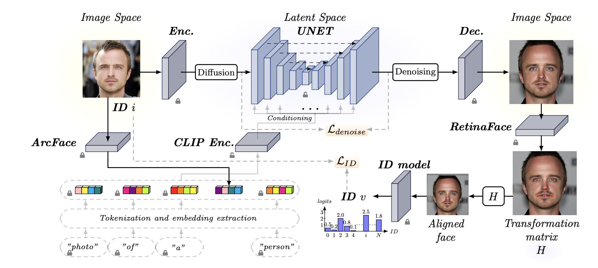

# IDSync ✨
**Identity-Consistent Face Synthesis with Latent Diffusion**

[](LICENSE)

IDSync is a diffusion-based framework for generating synthetic face images with **consistent identity across samples**. It fine-tunes a **Stable Diffusion–style latent diffusion model** (VAE latent space + U-Net denoiser, conditioned through a CLIP text encoder) for identity-conditioned face synthesis. 

Identity guidance is provided by **ArcFace embeddings** injected into the text-embedding space via a fixed prompt template (e.g., `"photo of a id person"`), and fused into the denoising U-Net through cross-attention. During training, IDSync adds a **frozen auxiliary identity classifier** and optimizes a **cross-entropy identity loss** (with face alignment via RetinaFace) alongside the standard denoising objective to improve identity consistency. After training, only the diffusion components are used for generation. 

## 📦 Downloads (Weights / Dataset / Assets)
Download pretrained weights + packed LMDB synthetic dataset + assets from:
https://huggingface.co/datasets/Jer0Shot/IDSync/tree/main

```bash
pip install -U huggingface_hub

# 1) weights -> ./weights/
huggingface-cli download Jer0Shot/IDSync \
  --repo-type dataset \
  --include "weights/**" \
  --local-dir . \
  --local-dir-use-symlinks False

# 2) dataset (LMDB) -> ./datasets/
huggingface-cli download Jer0Shot/IDSync \
  --repo-type dataset \
  --include "datasets/idsync_dataset_with_attrop.lmdb" \
  --local-dir . \
  --local-dir-use-symlinks False

# 3) assets -> ./assets/
huggingface-cli download Jer0Shot/IDSync \
  --repo-type dataset \
  --include "assets/**" \
  --local-dir . \
  --local-dir-use-symlinks False
```


## 📚 Table of Contents
- [🚀 Installation](#-installation)
- [🔎 Evaluation Pipeline Overview](#-evaluation-pipeline-overview)
- [1️⃣ Train the Attribute Model](#1-train-the-attribute-model)
- [2️⃣ Train the IDSync Stable Diffusion Model](#2-train-the-id-sync-stable-diffusion-model)
- [3️⃣ Infer with trained model](#3-infer-with-trained-model)
- [4️⃣ Generate Synthetic dataset](#4-generate-synthetic-dataset)
- [5️⃣ Evaluate Synthetic Dataset](#5-evaluate-synthetic-dataset)


The methodology is built on the Stable Diffusion pipeline, using the same conditioning approach as Arc2Face. Additionally, we introduce a novel identity consistency loss that helps the model generate faces more closely resembling the training data.




## 🚀 Installation

```bash
git clone https://github.com/JSabadin/IDSync.git
cd IDSync
pip install -e .
```

> **Note:** ⚙️ All commands in this repository are executed via `ml-tool`.  
> Run `ml-tool --help` to explore all available sub-commands and usage details.

> **Note:** 🐍 This project and its example commands are tested using **Python 3.8.10**.


## 🔎 Evaluation Pipeline Overview
1.  **Train the Attribute Model**
2.  **Train the IDSync Stable Diffusion Model**
3.  **Infer with the Trained Model**
4.  **Generate a Synthetic Dataset**
5.  **Evaluate the Synthetic Dataset**


## 1️⃣ Train the Attribute Model

Learn about the model architecture in the [attribute_model README](./src/attribute_model/README.md).


### a) Prepare the Dataset and the Configuration

- **Dataset**  
  Download and extract the Arc2Face-processed CASIA-WebFace 21M dataset:  
  https://huggingface.co/datasets/FoivosPar/Arc2Face

  We are using following zip files:
  ```text
    "0/0_0.zip",
    "0/0_1.zip", 
    "0/0_2.zip",
    "0/0_3.zip"
  ```
- **Configuration**  
  Edit `src/configs/attribute_model.py` by setting following:
  ```python
  config = {
      "dataset": {
          "dataset_dir": "/path/to/Arc2Face_448x448",  # Local dataset path
          "mapping_file": "/path/to/webface21_mapping.json", # Path for mapping used to filter the dataset (use ./assets/webface21_mapping.json)
      },
      …
  }
  ```
  > **Note:** 🗂️ Mapping is required to filter folders into IDs and exclude IDs with fewer than 10 images.


### b) Training Command

```bash
ml-tool atribute_model train \
  --config src/configs/attribute_model.py
```


## 2️⃣ Train the IDSync Stable Diffusion Model

### a) Precompute ArcFace token embeddings

This speeds up SD training in advance.

```bash
# Precompute dataset using arcface.onnx and previously extracted dataset
ml-tool diffusion precompute \
  --arcface_onnx ./assets/arcface.onnx \ 
  --image_dir    /path/to/data/Arc2Face_448x448 \
  --prompt_dir   /path/to/test_prompt_dir
```

The arcface.onnx model file can be downloaded from [Hugging Face](https://huggingface.co/FoivosPar/Arc2Face/tree/main).


### b) Install RetinaFace for face detection

We utilize [Pytorch_Retinaface](https://github.com/biubug6/Pytorch_Retinaface) for face detection and alignment before processing images through the ID model trained in Step 1.

```bash
# Clone the Pytorch_Retinaface repository
git clone https://github.com/biubug6/Pytorch_Retinaface.git
```
After cloning, download the RetinaFace pre-trained weights (Resnet50_Final.pth) and place them in the appropriate directory as specified in the repository documentation.

### c) Fine-tune the Stable Diffusion model using custom training strategy:

Once your prompts are precomputed and RetinaFace is installed, launch training with:

```bash
ml-tool diffusion train \
  --pretrained_model_name_or_path stabilityai/stable-diffusion-2-1 \
  --train_images_dir      /path/to/Arc2Face_448x448 \
  --train_prompt_dir      /path/to/precomputed_prompts \
  --folder_to_id_mapping  /path/to/folder_to_id_mapping.json \
  --atribute_model_weights_path /path/to/attribute_model_checkpoint.pth \
  --face_detector_weights /path/to/Resnet50_Final.pth \
  --pytorch_retinaface_library_path /path/to/Pytorch_Retinaface \
  --arcface_onnx_path     /path/to/arcface.onnx \
  --output_dir            /path/to/output_dir \
  --train_batch_size      8 \
  --resolution            224 \
  --gradient_accumulation_steps 64 \
  --num_train_epochs      4 \
  --learning_rate         1.6e-5 \
  --lr_scheduler          constant \
  --use_8bit_adam \
  --gradient_checkpointing \
  --mixed_precision       fp16 \
  --dataloader_num_workers 4 \
  --checkpointing_steps   4099 \
  --validation_epochs     1 \
  --id_loss_weight        0.001 \
  --report_to             wandb \
  --val_img_paths         /path/to/val_image1.jpg \
                          /path/to/val_image2.jpg \
  --num_inference_steps   25 \
  --num_inference_images  3 \
  --guidance_scale        3 \
  --resume_from_checkpoint latest
```


## 3️⃣ Infer with trained model

Run inference to generate identity-aware deepfakes using the trained model:

```bash
ml-tool diffusion infer \
  --arcface_onnx /path/to/arcface.onnx \
  --finetuned_model /path/to/finetuned_model \
  --retinaface_lib /path/to/retinaface_library \
  --retinaface_weights /path/to/Resnet50_Final.pth \
  --input_image /path/to/input_image.jpg \
  --output_dir /path/to/output_directory \
  --num_images 4 \
  --num_inference_steps 25 \
  --guidance_scale 3.0 \
  --seed 42
```


## 4️⃣ Generate Synthetic dataset

Once IDSync is ready, produce your synthetic dataset.

1. PCA on dataset

```bash
ml-tool diffusion run_pca \
  --arcface_onnx_path /path/to/arcface.onnx \
  --dataset_root /path/to/data \
  --output_dir /path/to/output \
  --json_mapping /path/to/mapping.json \
  --batch_size 5000 \
  --pca_components 300
```

2. Create dataset using PCA results

```bash
ml-tool diffusion create_synth \
  --pca_dir /path/to/pca \
  --output_dir /path/to/output \
  --finetuned_model_path /path/to/sd-finetuned \
  --arcface_onnx_path /path/to/arcface.onnx \
  --face_detector_weights /path/to/retinaface.pth \
  --pytorch_retinaface_library_path /path/to/retinaface-lib \
  --num_ids 10000 \
  --images_per_id 50
```


## 5️⃣ Evaluate Synthetic Dataset

### Option 1: Use the HaiyuWu/SOTA-Face-Recognition-Train-and-Test Repository
Run the face recognition (FR) training directly from the GitHub repository [HaiyuWu/SOTA-Face-Recognition-Train-and-Test](https://github.com/HaiyuWu/SOTA-Face-Recognition-Train-and-Test).

### Option 2: Use This Repository
You can train the face recognition model and run benchmarks on your generated images or on a real dataset:

```bash
ml-tool face_recognition train \
  --config src/configs/fr_model_casia.py
```
